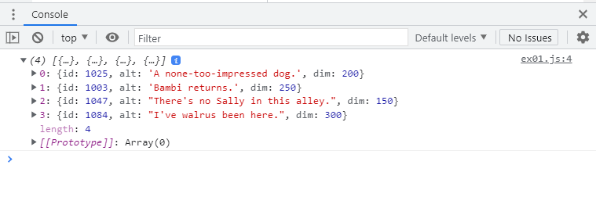
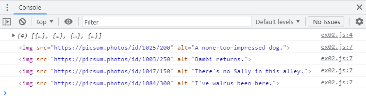

# Tutorial 05: Event Handling

**2021-10-08 (F)**

## Overview

This tutorial is meant to get you used to working with event handlers. Some of the handling will involve event delegation, 'cause you need to know how to do that! (In the assignment, for example.) 

## Instructions
   
I think we've done enough tutorials now that you know what to do. If you need a reminder, take a look at your tutorial 4 work.

---

## The Final Product

The goal of this tutorial is to make a little application that does the following:

- loads images from the [Lorem Picsum site](https://picsum.photos/) (very cool site btw) when a button is pressed
- removes images when they are clicked
- removes all images when the `a` key is pressed on the keyboard
- causes all images to fade (decrease opacity by 80%) when the `f` key is pressed

Here's a quick (like 22 seconds quick) screencast showing the finished product in action. There's no sound.

https://youtu.be/chRYQRRGBaU

We'll break this up into chunks of manageable exercises. 

You have to do these in order, so don't try and skip ahead, 'cause public displays of weeping make me uncomfortable.

--- 

## ex-01: turn JSON into an array of JS objects

### prerequisites

To complete this exercise, you should know how to:

- [ ] convert JSON that's in a file into JS objects
- [ ] link external JS to an HTML file
- [ ] ensure the DOM is loaded before attempting to run JS that uses the DOM

### goal

The file `data/pics.json` contains JSON for an array of objects holding information about the images that need to be created when the Load button is clicked.

_Take a quick look at the file contents - they're not **nearly** as crazy-long as the assignment data files. **Pro tip**: always get a feel for data you're dealing with by taking a quick look at it._

Our goal is to turn the contents of this file into an array of JS objects, store that array in a const/variable, and log it to the console.

Here's what I see in my console when I do that:

_Note: I expanded the array in the console and then took the screenshot._

### what you'll need to do in `ex-01/index.js` and `ex-01/index.html`

1. Create a well-named variable that holds the JS objects represented by the contents of `data/pics.json`.

_Don't forget to make any necessary changes in `index.html`! You can decide where to put necessary `<script>` tags and whether you want to practice using `DOMContentLoaded` or not._

---

## ex-02: turn JS objects into `` DOM elements

### prerequisites

To complete this exercise, you should know how to:

- [ ] create and use a function that returns image DOM elements
- [ ] turn an array of objects into an array of different, but related, objects
- [ ] iterate through arrays

### goal

We want to turn the array of JS objects you created in ex-01 into an array of `` DOM elements. Since we have multiple objects to convert, it makes sense to create a function that converts a _single_ JS object into a _single_ `` element, so we'll do that. 

We'll use our function to convert one array (of JS objects) into another array (of `` elements) and log those elements to the console.

Here's what logging these elements looks like:

_Since we're copying our work from ex-01 over, we see our array from ex-01 being displayed here as well._

_**WARNING**: those things in the screenshot are NOT Strings! They are `` elements!_

### what you'll need to do in `ex-02/index.js`

1. Copy your code from `ex-01` into `ex-02`. Don't forget your markup.

    _You'll be doing this - copying your working code from a previous exercise into the one you're currently working on - for the remaining exercises as well._

2. Create a well-named function that takes in a single image object (the ones from the JSON file) and returns an `` DOM element that has these properties:
   1. the `src` property should be the URL `https://picsum.photos/id/(id)/(dim)`. `(id)` and `(dim)` come from the image object. For example, the first object would help you build this `src`: `https://picsum.photos/id/1025/200`
   2. the `alt` property should be the `alt` property from the image object. For example, the first object would help you build this `alt`: "A none-too-impressed dog."

3. Turn the array of JS objects into an array of `` DOM elements. What JS array method was **made** for that task?

4. Loop through the results from 3 and output each DOM element to the console.

---

## ex03: add `` elements to the DOM when the Load button is clicked

### prerequisites

To complete this exercise, you should know how to:

- [ ] select a DOM element
- [ ] create an event handler
- [ ] register an event handler
- [ ] add elements to the DOM

### goal

When the Load button is clicked, the image elements from `ex-02` should appear in the browser. (See the screencast mentioned in [The Final Product](#the-final-product) for a demo.)

### what you'll need to do in `ex-03/index.js`

(instructions will be here for the full tutorial)

---

## ex04: use event delegation to remove images from the DOM when they are clicked

### prerequisites

To complete this exercise, you should know how to:

- [ ] select a DOM element
- [ ] create an event handler
- [ ] register an event handler
- [ ] remove elements from the DOM
- [ ] handle events using event delegation

### goal

When an image is clicked, it should be removed from the DOM. (See the screencast mentioned in [The Final Product](#the-final-product) for a demo.)

### what you'll need to do in `ex-04/index.js`

(instructions will be here for the full tutorial)

---

## ex05: make the app react to the `a` key being pressed

### prerequisites

To complete this exercise, you should know how to:

- [ ] select a DOM element
- [ ] create an event handler
- [ ] register an event handler
- [ ] react to keyboard input (look into the `keydown` event)

### goal

When the `a` key is pressed, all images in the DOM should be removed. (See the screencast mentioned in [The Final Product](#the-final-product) for a demo.)

### what you'll need to do in `ex-05/index.js`

(instructions will be here for the full tutorial)

---

## ex06: make the app react to the `f` key being pressed

### prerequisites

To complete this exercise, you should know how to:

- [ ] select multiple DOM elements
- [ ] create an event handler
- [ ] register an event handler
- [ ] react to keyboard input
- [ ] access and also change the opacity of a DOM element

### goal

When the `f` key is pressed, all images currently in the DOM should fade by 80%. (See the screencast mentioned in [The Final Product](#the-final-product) for a demo.)

### what you'll need to do in `ex-05/index.js`

(instructions will be here for the full tutorial)

---

## Submitting the tutorial

I will take a look through people's work early (_really_ early!) Wednesday mornings, so if you would like feedback on your code, please make sure you push your work back to your repo before 3 AM on that day.
