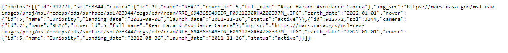

# Tutorial 07: Fetch, Rover (Preview)

**2022-02-28 (M)**


I've left in the full instructions for ex-00 through ex-03; you can get them done ahead of time before the full instructions are released.  

Reading through the other exercises will also give you a clue to other things you'll need to implement as well, thus making your tutorial time on Monday more effective.


## Overview

This tutorial will give you some more practice using fetch (and the resulting funky Promises). We're going to be grabbing [Mars Curiosity rover](https://en.wikipedia.org/wiki/Curiosity_(rover)) images. That sucker landed up there in 2012...and is still operational, doodling around and checking stuff out. That's pretty neat.

_If you have purchased the labs, Exercise 10.8 might be somewhat helpful in completing this tutorial, though it is by no means necessary!_

## Instructions
   
I think we've done enough tutorials now that you know what to do. If you need a reminder, take a look at your tutorial 4 work.

---

## The Final Product

The goal of this tutorial is to make a little application that shows the photos available from Curiosity from a given camera (it has multiple ones) on a given date. 

Here's a quick (like 17 seconds quick) screencast showing the finished product in action. There's no sound. 

(The full tutorial will have a link to the screencast here.)


We'll break this up into chunks of manageable exercises. 


## Getting Your Bearings  

You should take a look at the `index.html` file. Notice how near the bottom there are a pair of divs (`#photos` and `#spinny`), that hold any photos pulled in from the API and the loading animation, respectively. They both start off with a CSS class of "hidden". You should take a quick look in `style.css` to see what that class does.

You should also examine those radio buttons. The `value` attributes they have will be useful to you later....

--- 

## ex-00: grab an API key

You're going to need an API key for this. Fortunately, NASA is plain awesome and the process is free and gobsmackingly simple.

1. Go to https://api.nasa.gov.
2. Generate a key.
3. Write it down somewhere.
4. Say to yourself, "That's it?!?".

---

## ex-01: create an Endpoint constructor function

### prerequisites

To complete this exercise, you should know how to:

- [ ] create a constructor function that creates objects with methods
- [ ] read a simple API doc

### goal

We're going to be querying the Mars Rover Photos API from https://api.nasa.gov. In order to ask the API for photos from the Curiosity rover on a certain date from a certain camera, we need a very specific endpoint format. 

Our goal is to create an Endpoint constructor function that allows us to create Endpoint objects that are tied to our API key (from ex-00) and that we can ask for endpoints from certain dates/cameras.

If your constructor function is working properly, you should be able to do something like this in the console:

```js
const endpoint = new Endpoint();
endpoint.for({date: '2022-01-23', camera: 'rhaz'})
// returns the URL that would provide Curiosity rover photos 
// for 2022-01-23 from the Rear Hazard Avoidance Camera
```


### what you'll need to do

1. Look at the docs for the Mars Rover Photos API. In particular, see if you can figure out what an endpoint that needs to pull information for the Curiosity rover on a particular Earth date from a particular camera would look like.

    _The example queries shown in the docs should prove super-useful here._

2. Create a function called `Endpoint` in a new file called `endpoint.js`.

    _Notice the capital 'E' in the function name - we wanna build our convention-following muscles here._

3. Store off our API key in our constructor function. A constant seems reasonable for this.

4. Create a method in our constructor function called `for` that takes in an object with the properties hinted at in the example shown in our goal and returns a valid endpoint URL.

    _This is a useful technique that you might want to try out some time._

5. Bring the `endpoint.js` file into `index.html`.

6. Test out your function by calling it in the console with different dates and cameras. You should get URLs that you can open up in a browser to observe the resulting JSON. Here's what I see when I go to the URL generated in the example code shown in the goal:

     

---

## ex-02: create functions to show and hide the loading animation

### prerequisites

To complete this exercise, you should know how to:

- [ ] add and remove CSS classes from a DOM element

### goal

Our goal is to create two functions:

1. `showLoadingAnimation`, which hides `#photos` and unhides `#spinny`.
2. `hideLoadingAnimation`, which hides `#spinny` and unhides `#photos`.

These functions should add/remove the necessary CSS class to reach the goal. Do not use inline styling.

When your goal is complete, you should be able to head to the console and see your functions work.

Here's what I see when I use my functions:

https://youtu.be/ZChlI-rL9qc


### what you'll need to do in `index.js` 

1. Create `showLoadingAnimation` and `hideLoadingAnimation` so they work as expected.

---

## ex03: create a function to find the currently selected camera

### prerequisites

To complete this exercise, you should know how to:

- select all DOM elements matching a given CSS selector
- find the value from a radio button
- ask a radio button DOM element whether it is checked or not

### goal

When we click on the `Display Photos` button, one of the important pieces of information we need is the name of the camera currently selected. This information is stored in the value of the currently checked radio button - but how do we get it?

Our goal here is to make a function called `selectedCamera` that returns the value of the currently selected camera radio button.

If your function is working properly, you should be able to do something like this in the console:

```js
// assume the Front Hazard Avoidance radio button is checked
selectedCamera(); // returns `fhaz`

// assume we now click on the Navigation radio button
selectedCamera(); // now returns `navcam`
```

### what you'll need to do in `index.js` 

1. Create `selectedCamera` so it works as expected.

#### Hints

- There are quite a few ways to do this. Three suggestions:
  1. Select all the radio buttons, loop through them until you find the one that's been checked, and return that checked one's value.
  2. Start off selecting all radio buttons the same as (1), but then turn the NodeList into an Array with the `Array.from` method, and then use `find` to find the checked one (and return its value).
  3. The easiest way? Use the proper CSS selector to grab the checked one and return its value.

---

## ex04: put the pieces together!

### prerequisites

To complete this exercise, you should know how to:

- register an event handler 
- use fetch to get JSON from an API endpoint
- use a Promise chain to use fetched data

### goal

Our goal is to get the app behaving as shown in [The Final Product](#the-final-product) section above. 

### what you'll need to do in `index.js` 

Some instructions and hints will appear here in the full tutorial instructions...but you'll likely be able to piece together what you need to do just by looking at the final result....


---

## Submitting the tutorial

I will take a look through people's work early (_really_ early!) Wednesday mornings, so if you would like feedback on your code, please make sure you push your work back to your repo before 3 AM on that day.
