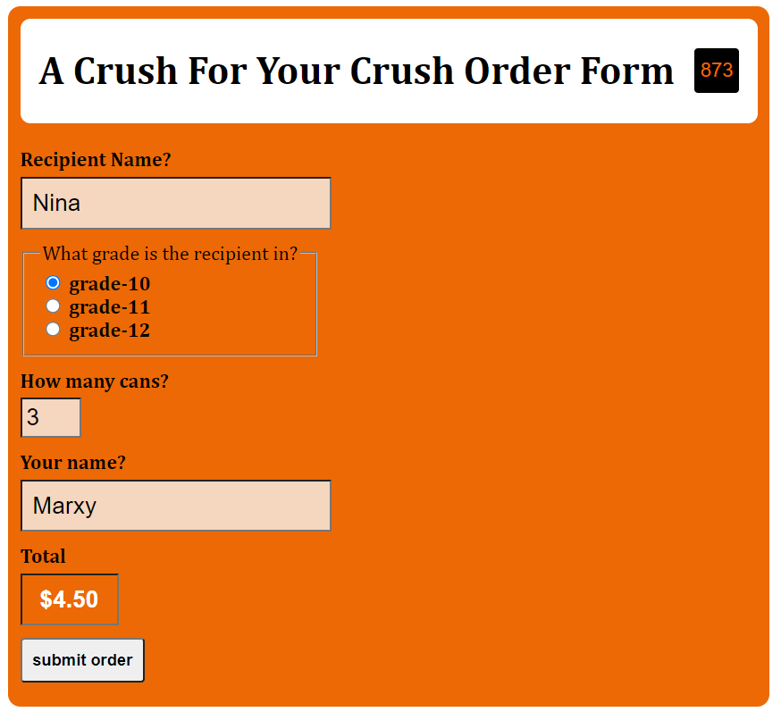

# Tutorial 09: Processing A Form & Validating Query Strings (Preview)

**2022-03-14 (M)**

## Overview

This tutorial will give you a chance to handle a form submission in PHP. We'll also practice validation of query strings attached to a URL.

These skills are all useful for assignment 2.

## Instructions
   
For the most part, you need to proceed the same way as you have for all our JS tutorials...but there are a few things that are different now that we're working with PHP:

- You should clone the starting repo into your XAMPP installation's `htdocs` directory.
- You'll need to remember to start up XAMPP and turn on the Apache server before you'll be able to do any work.
- Live Server isn't a thing anymore; instead, you'll need to go to the proper URL in a browser and refresh the browser manually every time you want to see the results of a change to your PHP code. Sigh.

--- 

## ex-01: handle a form

### prerequisites

To complete this exercise, you should know how to:

- [ ] Access form information through PHP's superglobals.
- [ ] Write output to a response using `echo`.
- [ ] Concatenate strings.
- [ ] Format numbers.

### goal

When the user arrives on `form.php`, they'll see a form. If they fill it out and submit it, it should go to a page that summarizes the form result in a certain format.

For example, if the form is filled out this way:

_Notice how you can totally use JavaScript and PHP together - JS is used here to calculate the total._

Then when the form is submitted, the following should be seen:

(a screenshot of the desired results)

### what you'll need to do

1. Take a look at the `form.php`. Take note of the various form elements, as you will need to access them to complete this exercise.
   
2. Create a PHP page that will handle the form submission. You can call it what you want, but make sure you then alter the form tag in `form.php` to use your submission handler.

3. Inside your submission handler page, create code that will print out the desired results in the desired format. Make sure you DON'T use the value from the #order-total input for the total cost of the Crushes. Why? Because a user could easily alter that field and wind up paying nothing! Instead, do the calculations necessary in your PHP file instead.

#### hints/suggestions

- You're going to be writing out quite a bit of stuff; you might want to make a little helper function that helps with that.
- There are functions that turn strings into numbers. (Like "20" into 20.) You'll likely need one.
- There are functions that format numbers (to a certain number of decimal places, for example).

---

## ex-02: validate a query string

### prerequisites

To complete this exercise, you should know how to:

- [ ] create and call PHP functions
- [ ] bring code from one PHP file into another
- [ ] use the documentation from php.net effectively
- [ ] redirect the browser to another page through the `header` function

### goal

When the user loads ex-02/index.php, our goal is to have one of the following things happen:

(There will be a series of steps here detailing under what conditions index.php should respond with the markup on that page and under what conditions it should cause a redirect to another page.

To make your testing life easier, use the following query strings and see if the indicated results happen. This list isn't exhaustive, but it captures the general idea.

| Query String | Should                     | Explanation           |
| ------------ | -------------------------- | --------------------- |
| ?userid=4    | continue to load index.php | valid key, valid user |

(lots of other rows will appear in the full tutorial)

### what you'll need to do

1. Examine the contents of  `login-helpers.php`. It has 2 functions, `isAdmin` and `isStandardUser` that are meant to simulate functions that would in real life talk to a database of some sort. You are welcome to make further helper functions in here - I think you'll find completing this exercise is **much** easier if you do!

2. Examine the contents of `index.php`. There is a block of PHP at the top where you'll need to import the helpers and write the code necessary to make the page behave as expected. There is no need to touch the HTML portion of the page.

3. The general idea in `index.php` should be to write conditionals that redirect to `admin.html` and `error.html` if necessary. If those conditionals aren't triggered, you're done - because then in that case, the response from the web server will just be the HTML in `index.php`, which is exactly what you want!

#### hints/suggestions

- There are functions you can find that tell you whether certain keys exist in arrays and whether a given string is a number. I found these useful. (Remember that php.net is your friend.)
- If you have the textbook, you'll find 12.8.1 useful here.
- When you redirect, don't use a URL for the redirect (like `http://localhost/tut-09/ex-02/error.html`) - just use a relative path (like `error.html`).
- If you bring in some useful helper methods, the logic you need in `index.php` is very simple. If you don't use helper methods, things might get a bit...hairy.

---

## Submitting the tutorial

I will take a look through people's work early (_really_ early!) Wednesday mornings, so if you would like feedback on your code, please make sure you push your work back to your repo before 3 AM on that day.
